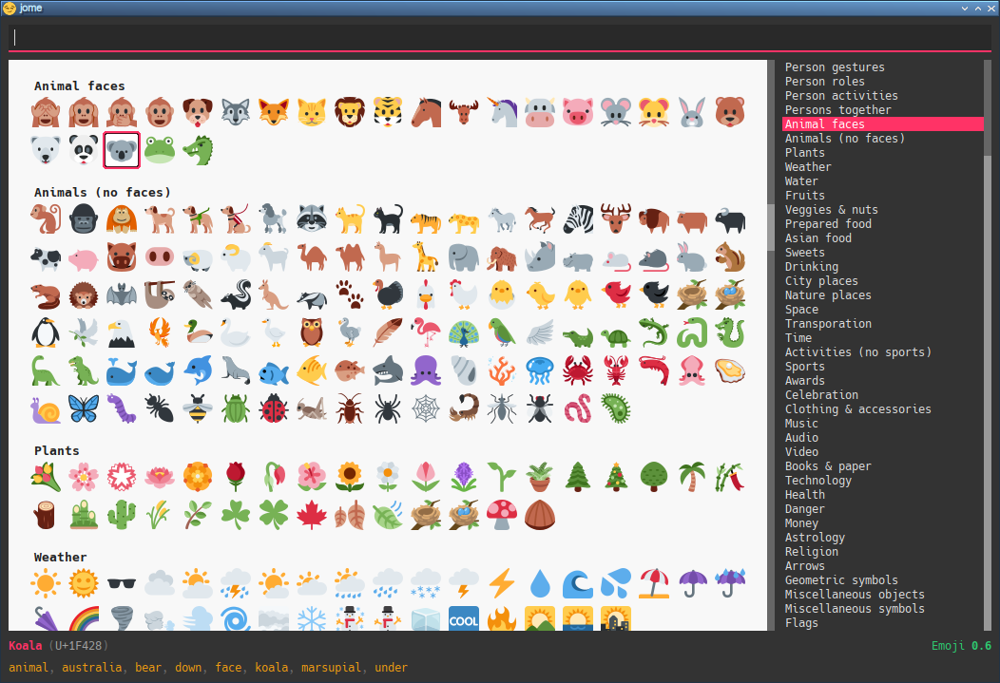

ifdef::env-github[]
:toc: macro
endif::env-github[]

ifndef::env-github[]
:toc: left
endif::env-github[]

:icons: font
:nofooter:

= jome 😏
Philippe Proulx <eepp.ca>
7 April 2025

**jome** (_joh_·_mee_) is a ⌨️ centric emoji picker 🖥️ application.

You can also pick an emoji with the 🖱️, don't worry.

jome has most of the interesting emojis of ⬆️ to
https://emojipedia.org/emoji-15.1/[Emoji{nbsp}15.1].

I'm not a fan of the usual very broad categories of emojis which do not
intersect so I made my own categories. A given emoji can be found in
more than 1️⃣ category. For example, 🦈 is found in both the _animals (no
faces)_ and _water_ categories. I find that it's easier to 🔍 by
theme than by very general category. Feel 🆓 to suggest more
categories.

jome is currently only tested on 🐧.

ifdef::env-github[]
toc::[]
endif::env-github[]

== Preview

image::screenshots/all.png[]

image::screenshots/palm.png[]

image::screenshots/wom.png[]

image::screenshots/wom-fact.png[]

image::screenshots/transp-cat.png[]

image::screenshots/transp-cat-car.png[]

image::screenshots/transp-cat-car-lig.png[]

[[build]]
== 🏗

You need:

* https://cmake.org/[CMake] ≥ 3.30.0
* A {cpp}14 compiler
* http://www.boost.org/[Boost] ≥ 1.70 (only to 🏗)
* https://json.nlohmann.me/[JSON for Modern C++] (only to 🏗,
  automatically 📥 by CMake)
* https://fmt.dev/[pass:[{fmt}]] (only to 🏗,
  automatically 📥 by CMake)
* Qt 5 (_Core_, _GUI_, _Widgets_, and _Network_ modules)

.🏗 jome
----
$ mkdir build && cd build && cmake -DCMAKE_BUILD_TYPE=release .. && make -j$(nproc)
----

[NOTE]
You need to _install_ jome for it to find the correct data 📄. If you
don't want to install it on your system, use
`-DCMAKE_INSTALL_PREFIX=path/to/install/directory` when you run `cmake`.

.Install jome
----
$ sudo make install
----

== Install on Arch Linux

To install on Arch Linux from the
https://aur.archlinux.org/packages/jome-git[jome-git] AUR package:

----
$ yay -Sy jome-git
----

== Usage

jome's purpose is to help you _pick_ an emoji.

When you <<accept-emoji,✅>> an emoji (with the ⌨️ or with the 🖱️),
jome 🖨️ the UTF-8 emoji or the Unicode codepoints (👀 the
<<opt-f,`-f`{nbsp}option>>), with an optional prefix (👀 the
<<opt-p,`-p`{nbsp}option>>) for each codepoint, to the standard output.
Additionally, jome can:

* Copy the UTF-8 emoji or the Unicode codepoints to the 📋. 👀
  the <<opt-b,`-b`{nbsp}option>>.

* Execute a custom command which 📨 the UTF-8 emoji or the Unicode
  codepoints, with an optional prefix for each codepoint, as its
  last argument(s). 👀 the <<opt-c,`-c`{nbsp}option>>.

* Send the UTF-8 emoji or the Unicode codepoints, with an optional
  prefix for each codepoint, in response to a client which requested
  picking an emoji. 👀 the <<opt-s,`-s`{nbsp}option>>.

If you close the 🪟 (you can 👇 **Escape** or **Ctrl**pass:[+]**C**
to do this), then jome 🖨️ nothing to the standard output
and executes nothing.

If you don't start jome in <<server-mode,server mode>>
(<<opt-s,`-s`{nbsp}option>>) and you don't specify the
<<opt-q,`-q`{nbsp}option>>, then jome immediately 👋 after you ✅
an emoji or close the 🪟.

=== Graphical interface

image::screenshots/all.png[]

There are 4️⃣ sections:

[[find-box]]🔍 box (⬆️)::
    Input box where you can ⌨️ a query to <<find-emojis,🔍 emojis>>.

Emojis::
    All emojis (with an empty 🔍 box) or 🔍 results.
+
When there's at least 1️⃣ emoji, there's always a selected emoji with a
🔲 box around it.
+
🖱️ an emoji to ✅ it.
+
Hover an emoji to update the ⬇️ emoji info text temporarily.
+
Use the <<opt-d,`-d`{nbsp}option>> to make the background behind emojis
dark.

Category 📜::
    📜 of available categories.
+
When all emojis are 👁️ (the 🔍 box is empty), 🖱️ a category
name to scroll to this emoji category.
+
The first category, _Recent_, is a special category with the recently
✅ emojis.
+
Use the <<opt-H,`-H`{nbsp}option>> to override the maximum number
of recently ✅ emojis.
+
🙈 the whole category 📜 with the <<opt-C,`-C`{nbsp}option>>.

Emoji info text (⬇️)::
    Name, Unicode codepoints, Emoji standard version, and keywords of the
    selected or hovered emoji.
+
🙈 the keyword list 📜 with the <<opt-k,`-k`{nbsp}option>>.

[[find-emojis]]
=== 🔍 emojis

The power of jome is its <<find-box,🔍 box>>.

When you launch jome, the 🔍 box is focused, and it should stay
focused unless you browse emojis manually with the intention of
✅ one with the 🖱️.

The format of a query is 1️⃣ of:

* `_TERMS_`
* `_CAT_/`
* `_CAT_/_TERMS_`

where:

`_CAT_`::
    Partial name of categories in which to 🔍.

`_TERMS_`::
    Space-separated 📜 of 🔍 terms.
+
For an emoji to be part of the results, at least 1️⃣ of its keywords
must contain _all_ the 🔍 terms.

[[select]]
=== Select and ✅ an emoji

To select an emoji, use the following ⌨️:

⬅️, ➡️, ⬆️, ⬇️::
    Go ⬅️/➡️/⬆️/⬇️.

**Ctrl**pass:[+]⬅️, **Ctrl**pass:[+]➡️::
    Go ⬅️/➡️ 5️⃣ emojis.

**Page ⬆️**, **Page ⬇️**::
    Go ⬆️/⬇️ 10 rows.

**Home**::
    Go to the first emoji.

**End**::
    Go to the last emoji.

[[accept-emoji]]To ✅ the selected emoji, 👇:

**Enter**::
    ✅ the selected emoji with, if applicable:

Without the <<opt-t,`-t`{nbsp}option>>:::
    No skin tone (🟡).

With the `-t` option:::
    The default skin tone (value of `-t`).

**F1**, **F2**, **F3**, **F4**, **F5**::
    If the selected emoji supports skin tones, ✅ the selected
    emoji with a light, medium-light, medium, medium-dark, or dark
    skin tone, overriding the <<opt-k,`-t`{nbsp}option>> (if any).

To ❌, 👇 **Escape** or **Ctrl**pass:[+]**C**, or close the 🪟.

=== Go to Emojipedia page

To go to the https://emojipedia.org/[Emojipedia] 🌐 of the
<<select,selected>> emoji, 👇 **F12**.

To go to the Emojipedia 🌐 of any emoji with the 🖱️, right-click it and
click "`Go to Emojipedia page`".

=== 👤-defined emoji keywords

You can either replace or ➕ the built-in 📜 of keywords which
jome searches when 🔍 emojis.

To set 👤-defined keywords, create an `emojis.json` 📄 within:

[horizontal]
On 🐧::
    `~/.config/jome/`

On 🍎::
    `~/Library/Preferences/jome`

On 🪟::
    `C:/Users/__USERNAME__/AppData/Local/jome` (probably) or
    `C:/ProgramData/jome`

`emojis.json` must contain a JSON object where 🔑 are emojis and
values are objects. Each value may contain one of:

`keywords`::
    An array of keywords which replaces the built-in keywords entirely
    for this emoji.

`extra-keywords`::
    An array of keywords which ➕ either the built-in keywords
    or the keywords of the `keywords` entry for this emoji.

Example:

[source,json]
----
{
  "🍁": {
    "extra-keywords": ["canada", "laurentides"]
  },
  "😃": {
    "keywords": ["yay", "hourra"]
  },
  "🚬": {
    "extra-keywords": ["claude poirier"]
  },
  "🫚": {
    "extra-keywords": ["canada dry", "martin deschamps"]
  }
}
----

[[cl-options]]
=== Command-line options

[%header,cols="1d,3a"]
|===
|Option |Description

|[[opt-f]]`-f _FMT_`
|Set the output format to `_FMT_`:

`utf-8` (default)::
    UTF-8 emoji.

`cp`::
    Space-separated Unicode codepoints (hexadecimal).
+
Example: `1f645 200d 2642 fe0f`
+
Prepend a prefix to each codepoint with <<opt-p,`-p`>>.

|[[opt-p]]`-p _PREFIX_`
|Set the prefix to be prepended to each Unicode codepoint with
`-f cp`.

For example, with `-f cp` and `-p U+`:

----
U+1f645 U+200d U+2642 U+fe0f
----

|`-n`
|Do not 🖨️ a newline after 🖨️ the emoji or codepoints.

|[[opt-V]]`-V`
|Do not 🖨️
https://emojipedia.org/variation-selector-16[Variation Selector-16]
(VS-16) codepoints.

VS-16 is a suffix codepoint which specifies that the preceding character
should be displayed with emoji presentation. For example, ♥ (which
predates Unicode emojis) followed with VS-16 becomes{nbsp}♥️.

There are applications/fonts which don't like VS-16.

|[[opt-t]]`-t _TONE_`
|Set the default skin tone to `_TONE_` instead of none:

[horizontal]
`L`:: Light.
`ML`:: Medium-light.
`M`:: Medium.
`MD`:: Medium-dark.
`D`:: Dark.

The **F1** to **F5** keys still <<accept-emoji,✅>> an emoji
with a specific skin tone.

|[[opt-c]]`-c _CMD_`
|When you ✅ an emoji, execute command `_CMD_` 20{nbsp}ms
_after_ closing the jome 🪟.

jome interprets `_CMD_` like a 🐚 does, so you can have arguments too.

`_CMD_` 📨 the UTF-8 emoji or the Unicode codepoints (depending on
the <<opt-f,`-f`{nbsp}option>>) with their optional prefix as its last
argument(s).

Examples with https://www.semicomplete.com/projects/xdotool/[xdotool]:

----
$ jome -c 'xdotool type'
$ jome -f cp -p U -c 'xdotool key --delay 20'
----

|[[opt-b]]`-b`
|When you ✅ an emoji, copy the UTF-8 emoji or the Unicode
codepoints (depending on the <<opt-f,`-f`{nbsp}option>>) to the 📋.

WARNING: This uses
https://doc.qt.io/qt-5/qclipboard.html[`QClipboard`] and is known
not to always work, depending on your 🪟 🧑‍💼.

|[[opt-q]]`-q`
|Do not 👋 when you <<accept-emoji,✅>> an emoji.

By default, when you ✅ an emoji (with the ⌨️ or with the 🖱️), jome:

. 🖨️ the ✅ emoji or its codepoints to the standard output.
. 🙈 its 🪟.
. **Optional**: Copies the ✅ emoji/codepoints to the
  📋 (👀 the <<opt-b,`-b`{nbsp}option>>).
. **Optional**: Executes a command (👀 the <<opt-c,`-c`{nbsp}option>>)
  after 20{nbsp}ms.
. **If not running in server mode**, 👋 (👀 the
  <<opt-s,`-s`{nbsp}option>>).

With the `-q`{nbsp}option, jome does not 🙈 its 🪟 and does not 👋
when you ✅ an emoji so that you can make it 🖨️ multiple emojis
and/or execute a command multiple ⌚ with multiple emojis without
restarting the application.

You cannot specify the `-q` and <<opt-s,`-s`>>{nbsp}options at the
same{nbsp}⌚.

|[[opt-s]]`-s _NAME_`
|Start jome in <<server-mode,server mode>> and set the server name
to `_NAME_`.

On Unix, this creates the socket 📄 `/tmp/_NAME_` which must _not exist_
before you start jome.

You cannot specify the `-s` and <<opt-q,`-q`>>{nbsp}options at the
same{nbsp}⌚.

|[[opt-d]]`-d`
|Use a 🌚 background for emojis.

|[[opt-C]]`-C`
|🙈 the category 📜.

|[[opt-k]]`-k`
|🙈 the keyword 📜.

|[[opt-w]]`-w _WIDTH_`
|Set the width of individual emojis to `_WIDTH_`{nbsp}pixels, amongst
16, 24, 32 (default), 40, or{nbsp}48.

|[[opt-P]]`-P _PERIOD_`
|Set the flashing period of the selection 🔲 to
`_PERIOD_`{nbsp}ms (greater than or equal to{nbsp}32).

The selection 🔲 doesn't flash by default.

|[[opt-H]]`-H _COUNT_`
|Set the maximum number of recently ✅ emojis
to{nbsp}``__COUNT__`` instead of{nbsp}30.
|===

[[server-mode]]
=== Server mode

jome features a server mode to avoid creating a process (a Qt 🪟 can
be quite long to create) every ⌚ you need to pick an emoji. With this
mode, you can 👁️ the jome 🪟 instantaneously.

To start jome in server mode, use the <<opt-s,`-s`{nbsp}option>> to
specify the server name:

----
$ jome -s mein-server
----

This creates a local server named `mein-server`. On Unix, it creates the
socket 📄 `/tmp/mein-server`.

[IMPORTANT]
--
On Unix, the server mode won't work if the socket 📄
already exists. Remove the 📄 before you start jome in server mode:

----
$ rm -f /tmp/mein-server
$ jome -s mein-server
----
--

When jome starts in server mode, it does not 👁️ its 🪟. Instead,
it ⌛ for a command sent by the client, `jome-ctl`. To 👁️ the
🪟:

----
$ jome-ctl mein-server
----

When you <<accept-emoji,✅>> an emoji, `jome-ctl` 🖨️ what jome
also 🖨️ to the standard output and 👋 with exit code 0️⃣.
Therefore, the output format of `jome-ctl` is 🎛 by the
<<cl-options,options>> passed to `jome`.

If you ❌ jome (👇 **Escape** or **Ctrl**pass:[+]**C**, or
close the 🪟), `jome-ctl` 🖨️ nothing and returns with exit code 1️⃣.

In server mode, jome does not 👋 once you ✅ an emoji or ❌:
it 🙈 the 🪟 and keeps 👂. To make it 👋 gracefully,
which also removes the socket 📄:

----
$ jome-ctl mein-server quit
----

You don't need to use what `jome-ctl` 🖨️ to the standard output. You can
use jome in server mode with the <<opt-c,`-c`{nbsp}option>> to make jome
execute a command itself. For example:

----
$ rm -f mein-server
$ jome -s mein-server -c 'xdotool type'
----

Then, bind a ⌨️ shortcut to:

----
$ jome-ctl mein-server
----

== ⌨️ the ✅ emoji

Here are Bash 📜 to ⌨️ the ✅ emoji with
https://www.semicomplete.com/projects/xdotool/[xdotool].

=== Direct mode

With `xdotool key`::
+
[source,bash]
----
#!/usr/bin/bash

codepoints=$(jome -f cp -p U)

if (($? != 0)); then
    exit 1
fi

xdotool key --delay 20 $codepoints
----

With `xdotool type`::
+
[source,bash]
----
#!/usr/bin/bash

emoji=$(jome)

if (($? != 0)); then
    exit 1
fi

xdotool type "$emoji"
----

=== Server mode

With `xdotool key`::
+
[source,bash]
----
#!/usr/bin/bash

socket_name=jome.socket.$(id -u)

if [[ ! -e "/tmp/$socket_name" ]]; then
    jome -s "$socket_name" -n -w48 -f cp -p U & disown

    until [[ -e "/tmp/$socket_name" ]]; do
        sleep .1
    done
fi

emoji=$(jome-ctl "$socket_name")

if (($? == 0)); then
    sleep .02
    xdotool key --delay 20 "$emoji"
fi
----

With `xdotool type`::
+
[source,bash]
----
#!/usr/bin/bash

socket_name=jome.socket.$(id -u)

if [[ ! -e "/tmp/$socket_name" ]]; then
    jome -s "$socket_name" -n -w48 & disown

    until [[ -e "/tmp/$socket_name" ]]; do
        sleep .1
    done
fi

emoji=$(jome-ctl "$socket_name")

if (($? == 0)); then
    sleep .02
    xdotool type "$emoji"
fi
----
