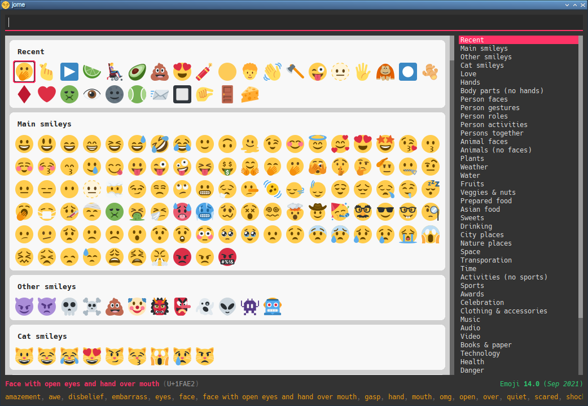
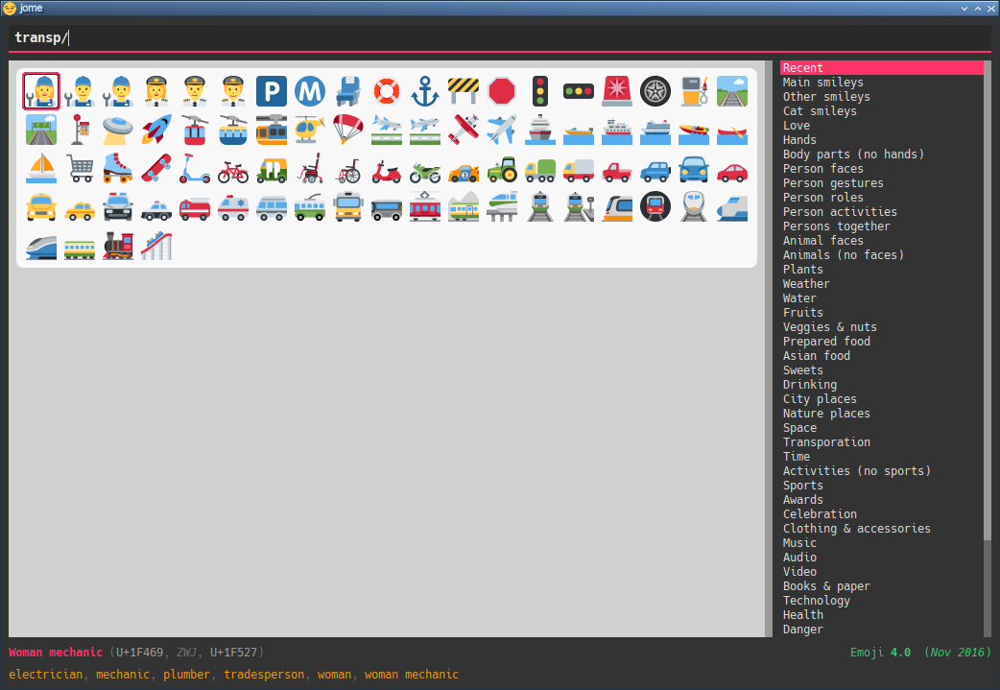

= jome 😀
Philippe Proulx <eepp.ca>

_jome_ is a ⌨ centric emoji picker desktop application.

You can also pick an emoji with the 🖱, don't worry.

jome has most of the interesting emojis of
https://emojipedia.org/emoji-11.0/[Emoji{nbsp}11.0].

I'm not a fan of the usual very broad categories of emojis which do not
intersect so I made my own categories. A given emoji can be found in
more than one category. For example, 🦈 is found in both the _animals (no
faces)_ and _water_ categories. I find that it's easier to visually
search by theme than by very general category. Feel free to suggest more
categories.

jome is currently only tested on 🐧.

== Preview

image::screenshots/palm.png[]

image::screenshots/wom.png[]

image::screenshots/wom-fact.png[]

image::screenshots/transp-cat-car.png[]

image::screenshots/transp-cat-car-lig.png[]

== Build

You need:

* https://cmake.org/[CMake] ≥ 3.1.0
* A pass:[C++14] compiler
* http://www.boost.org/[Boost] ≥ 1.58 (only to build)
* Qt 5 (_Widgets_ and _Gui_ component)
* Python 3
** The `cairo` package
** The `cairosvg` package
** The `yaml` package

.Build and install jome
----
mkdir build
cd build
cmake -DCMAKE_BUILD_TYPE=release ..
make -j$(nproc)
sudo make install
----

[NOTE]
You need to _install_ jome for it to find the correct data files. If you
don't want to install it on your system, use
`-DCMAKE_INSTALL_PREFIX=path/to/install/directory` when running `cmake`.

== Usage

TODO!

== Type the selected emoji

Here's a Bash script which types, using
https://www.semicomplete.com/projects/xdotool/[xdotool], the selected
emoji once jome quits:

[source,bash]
----
#!/usr/bin/bash

codepoints="$(jome -f cp)"

if [ $? -ne 0 ]; then
    exit 1
fi

if [ -z "$codepoints" ]; then
    exit 1
fi

xdotool_args=""

for cp in $codepoints; do
    xdotool_args="$xdotool_args U$cp"
done

xdotool key --delay 50 $xdotool_args
----
