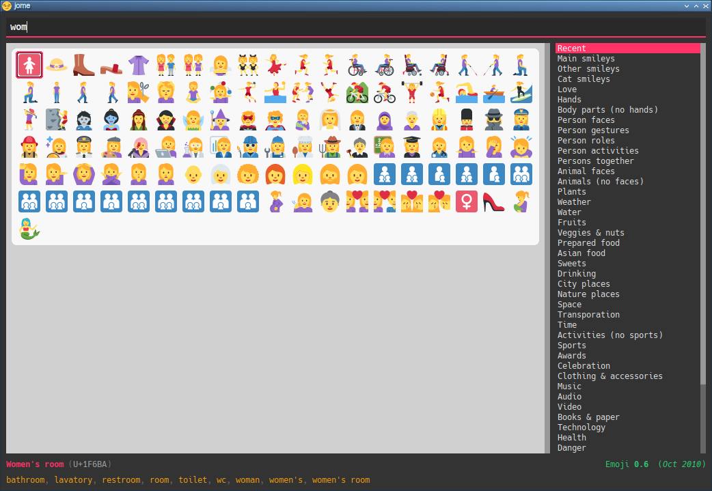
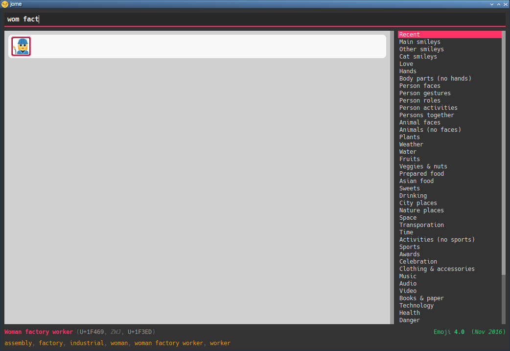

= jome 😀
Philippe Proulx <eepp.ca>

**jome** (_joh_·_mee_) is a ⌨️ centric emoji picker desktop application.

You can also pick an emoji with the 🖱, don't worry.

jome has most of the interesting emojis of
https://emojipedia.org/emoji-11.0/[Emoji{nbsp}11.0].

I'm not a fan of the usual very broad categories of emojis which do not
intersect so I made my own categories. A given emoji can be found in
more than one category. For example, 🦈 is found in both the _animals (no
faces)_ and _water_ categories. I find that it's easier to visually
search by theme than by very general category. Feel free to suggest more
categories.

jome is currently only tested on 🐧.

== Preview

image::screenshots/all.png[]

image::screenshots/palm.png[]

image::screenshots/transp-cat.png[]

image::screenshots/transp-cat-car.png[]

image::screenshots/transp-cat-car-lig.png[]

== Build

You need:

* https://cmake.org/[CMake] ≥ 3.1.0
* A pass:[C++14] compiler
* http://www.boost.org/[Boost] ≥ 1.58 (only to build)
* Qt 5 (_Core_, _GUI_, _Widgets_, and _Network_ modules)
* Python 3 (only to build)
** The `cairo` package
** The `cairosvg` package
** The `yaml` package

.Build and install jome
----
$ mkdir build
$ cd build
$ cmake -DCMAKE_BUILD_TYPE=release ..
$ make -j$(nproc)
$ sudo make install
----

[NOTE]
You need to _install_ jome for it to find the correct data files. If you
don't want to install it on your system, use
`-DCMAKE_INSTALL_PREFIX=path/to/install/directory` when you run `cmake`.

== Usage

jome's purpose is to help you pick an emoji.

When you <<accept-emoji,accept>> an emoji (with the ⌨️ or with the 🖱),
jome prints the UTF-8 emoji or the Unicode codepoints (see the
<<opt-f,`-f` option>>), with an optional prefix (see the <<opt-p,`-p`
option>>) for each codepoint, to the standard output. Additionally, jome
can:

* Execute a custom command which gets the UTF-8 emoji or the Unicode
  codepoints, with an optional prefix for each codepoint, as its
  last argument(s). See the <<opt-s,`-c` option>>.

* Send the UTF-8 emoji or the Unicode codepoints, with an optional
  prefix for each codepoint, in response to a client which requested
  picking an emoji. See the <<opt-s,`-s` option>>.

If you close the window (you can press **Escape** to do this), then jome
prints nothing to the standard output and executes nothing.

If you don't start jome in <<server-mode,server mode>> (<<opt-s,`-s`
option>>) and you don't specify the <<opt-q,`-q` option>>, then jome
immediately quits after you accept an emoji or close the window.

=== Graphical interface

image::screenshots/all.png[]

There are four sections:

[[find-box]]Find box (top)::
    Input box where you can type a query to <<find-emojis,find emojis>>.

Emojis::
    All emojis (with an empty find box) or find results.
+
When there's at least one emoji, there's always a selected emoji with a
red box around it.
+
Click an emoji to accept it.
+
Hover an emoji to update the bottom emoji info text temporarily.
+
Use the <<opt-d,`-d` option>> to make the background behind emojis dark.

Category list::
    List of available categories.
+
When all emojis are shown (the find box is empty), click a category
name to scroll to this emoji category.
+
The first category, _Recent_, is a special category with the recently
accepted emojis.

Emoji info text (bottom)::
    Name and Unicode codepoints of the selected or hovered emoji.

[[find-emojis]]
=== 🔍 emojis

The power of jome is its <<find-box,find box>>.

When you launch jome, the find box is focused, and it should stay
focused unless you browse emojis manually with the intention of
accepting one with the 🖱.

The format of a query is one of:

* `_TERMS_`
* `_CAT_/`
* `_CAT_/_TERMS_`

where:

`_CAT_`::
    Partial name of categories in which to search.

`_TERMS_`::
    Space-separated list of search terms.
+
For an emoji to be part of the results, at least one of its keywords
must contain _all_ the search terms.

=== Select and accept an emoji

To select an emoji, use the following keys:

⬅️, ➡️, ⬆️, ⬇️::
    Go left/right/up/down.

**Ctrl**pass:[+]⬅️, **Ctrl**pass:[+]➡️::
    Go left/right 5 emojis.

**Page ⬆️**, **Page ⬇️**::
    Go up/down 10 rows.

**Home**::
    Go to the first emoji.

**End**::
    Go to the last emoji.

[[accept-emoji]]To accept the selected emoji, press:

**Enter**::
    Accept the selected emoji with the default skin tone
    (if applicable).

**F1**, **F2**, **F3**, **F4**, **F5**::
    If the selected emoji supports skin tones, accept the selected
    emoji with a light, medium-light, medium, medium-dark, or dark
    skin tone.

To cancel, press **Escape** or close the window.

[[cl-options]]
=== Command-line options

[[opt-f]]`-f _FMT_`::
    Set the output format to `_FMT_`:
+
--
`utf-8` (default)::
    UTF-8 emoji.

`cp`::
    Space-separated Unicode codepoints (hexadecimal).
+
Example: `1f645 200d 2642 fe0f`
--

[[opt-p]]`-p _PREFIX_`::
    Set the prefix to be prepended to each Unicode codepoint.
+
For example, with `-f cp` and `-p U+`: `U+1f645 U+200d U+2642 U+fe0f`.

`-n`::
    Do not print a newline after printing the emoji or codepoints.

[[opt-c]]`-c _CMD_`::
    When you accept an emoji, execute command `_CMD_` 20{nbsp}ms
    _after_ closing the jome window.
+
jome interprets `_CMD_` like a shell does, so you can have arguments
too.
+
`_CMD_` receives the UTF-8 emoji or the Unicode codepoints (depending on
the <<opt-f,`-f`>> option) with their optional prefix as its last
argument(s).
+
Examples with https://www.semicomplete.com/projects/xdotool/[xdotool]:
+
----
$ jome -c 'xdotool type'
$ jome -f cp -p U -c 'xdotool key --delay 20'
----

[[opt-q]]`-q`::
    Do not quit when you <<accept-emoji,accept>> an emoji.
+
By default, when you accept an emoji (with the ⌨️ or with the 🖱), jome:
+
--
. Prints the accepted emoji or its codepoints to the standard output.
. Hides its window.
. **Optional**: Executes a command (see the <<opt-c,`-c` option>>) after
  20{nbsp}ms.
. **If not running in server mode**, quits (see the <<opt-s,`-s`
  option>>).
--
+
With the `-q` option, jome does not hide its window and does not quit
when you accept an emoji so that you can make it print multiple emojis
and/or execute a command multiple times with multiple emojis without
restarting the application.
+
You cannot specify the `-q` and <<opt-s,`-s`>> options at the same time.

[[opt-s]]`-s _NAME_`::
    Start jome in <<server-mode,server mode>> and set the server name
    to `_NAME_`.
+
On Unix, this creates the socket file `/tmp/_NAME_` which must
_not exist_ before you start jome.
+
You cannot specify the `-s` and <<opt-q,`-q`>> options at the same time.

[[opt-d]]`-d`::
    Use a dark background for emojis.

[[server-mode]]
=== Server mode

jome features a server mode to avoid creating a process (a Qt window can
be quite long to create) every time you need to pick an emoji. With this
mode, you can bring up the jome window instantaneously.

To start jome in server mode, use the <<opt-s,`-s` option>> to specify
the server name:

----
$ jome -s mein-server
----

This creates a local server named `mein-server`. On Unix, it creates the
socket file `/tmp/mein-server`.

[IMPORTANT]
--
On Unix, the server mode won't work if the socket file
already exists. Remove the file before you start jome in server mode:

----
$ rm -f /tmp/mein-server
$ jome -s mein-server
----
--

When jome starts in server mode, it does not show its window. Instead,
it waits for a command sent by the client, `jome-ctl`. To show the
window:

----
$ jome-ctl mein-server
----

When you <<accept-emoji,accept>> an emoji, `jome-ctl` prints what jome
also prints to the standard output and quits with exit code 0.
Therefore, the output format of `jome-ctl` is controlled by the
<<cl-options,options>> passed to `jome`.

If you cancel jome (press **Escape** or close the window), `jome-ctl`
prints nothing and returns with exit code 1.

In server mode, jome does not quit once you accept an emoji or cancel:
it hides the window and keeps listening. To make it quit gracefully,
which also removes the socket file:

----
$ jome-ctl mein-server quit
----

You don't need to use what `jome-ctl` prints to the standard output.
You can use jome in server mode with the <<opt-c,`-c` option>> to make
jome execute a command itself. For example:

----
$ rm -f mein-server
$ jome -s mein-server -c 'xdotool type'
----

Then, bind a ⌨️ shortcut to:

----
$ jome-ctl mein-server
----

== Type the accepted emoji

Here are Bash scripts to type the accepted emoji with
https://www.semicomplete.com/projects/xdotool/[xdotool].

=== Non server mode

With `xdotool key`::
+
[source,bash]
----
#!/usr/bin/bash

codepoints="$(jome -f cp -p U)"

if [ $? -ne 0 ]; then
    exit 1
fi

xdotool key --delay 20 $codepoints
----

With `xdotool type`::
+
[source,bash]
----
#!/usr/bin/bash

emojis="$(jome)"

if [ $? -ne 0 ]; then
    exit 1
fi

xdotool $emojis
----

=== Server mode

With `xdotool key`::
+
[source,bash]
----
#!/usr/bin/bash

socket_name="jome.socket.$(id -u)"

if ! pidof jome &>/dev/null; then
    rm -f "/tmp/$socket_name"
    jome -s "$socket_name" -f cp -p U -c 'xdotool key --delay 20' & disown

    while [ ! -e "/tmp/$socket_name" ]; do
        sleep .1
    done
fi

jome-ctl "$socket_name"
----

With `xdotool type`::
+
[source,bash]
----
#!/usr/bin/bash

socket_name="jome.socket.$(id -u)"

if ! pidof jome &>/dev/null; then
    rm -f "/tmp/$socket_name"
    jome -s "$socket_name" -c 'xdotool type' & disown

    while [ ! -e "/tmp/$socket_name" ]; do
        sleep .1
    done
fi

jome-ctl "$socket_name"
----
