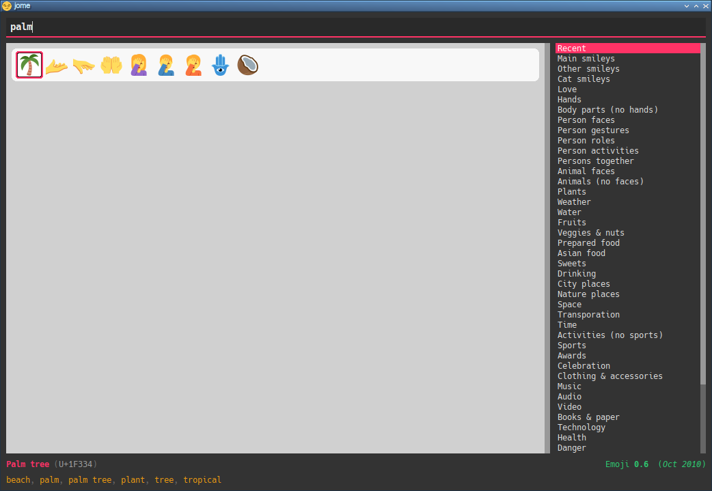

ifdef::env-github[]
:toc: macro
endif::env-github[]

ifndef::env-github[]
:toc: left
endif::env-github[]

:icons: font
:nofooter:

= jome 😏
Philippe Proulx <eepp.ca>
5 April 2025

**jome** (_joh_·_mee_) is a ⌨️ centric emoji picker 🖥 application.

You can also pick an emoji with the 🖱, don't worry.

jome has most of the interesting emojis of up to
https://emojipedia.org/emoji-15.1/[Emoji{nbsp}15.1].

I'm not a fan of the usual very broad categories of emojis which do not
intersect so I made my own categories. A given emoji can be found in
more than 1️⃣ category. For example, 🦈 is found in both the _animals (no
faces)_ and _water_ categories. I find that it's easier to 🔍 by
theme than by very general category. Feel 🆓 to suggest more
categories.

jome is currently only tested on 🐧.

ifdef::env-github[]
toc::[]
endif::env-github[]

== Preview

image::screenshots/all.png[]

image::screenshots/wom.png[]

image::screenshots/wom-fact.png[]

image::screenshots/transp-cat.png[]

image::screenshots/transp-cat-car.png[]

image::screenshots/transp-cat-car-lig.png[]

[[build]]
== 🏗

You need:

* https://cmake.org/[CMake] ≥ 3.30.0
* A {cpp}14 compiler
* http://www.boost.org/[Boost] ≥ 1.70 (only to 🏗)
* https://json.nlohmann.me/[JSON for Modern C++] (only to 🏗,
  automatically 📥 by CMake)
* https://fmt.dev/[pass:[{fmt}]] (only to 🏗,
  automatically 📥 by CMake)
* Qt 5 (_Core_, _GUI_, _Widgets_, and _Network_ modules)

.🏗 jome
----
$ mkdir build && cd build && cmake -DCMAKE_BUILD_TYPE=release .. && make -j$(nproc)
----

[NOTE]
You need to _install_ jome for it to find the correct data 📄. If you
don't want to install it on your system, use
`-DCMAKE_INSTALL_PREFIX=path/to/install/directory` when you run `cmake`.

.Install jome
----
$ sudo make install
----

== Install on Arch Linux

To install on Arch Linux from the
https://aur.archlinux.org/packages/jome-git[jome-git] AUR package:

----
$ yay -Sy jome-git
----

== Usage

jome's purpose is to help you _pick_ an emoji.

When you <<accept-emoji,accept>> an emoji (with the ⌨️ or with the 🖱),
jome 🖨 the UTF-8 emoji or the Unicode codepoints (see the
<<opt-f,`-f`{nbsp}option>>), with an optional prefix (see the
<<opt-p,`-p`{nbsp}option>>) for each codepoint, to the standard output.
Additionally, jome can:

* Copy the UTF-8 emoji or the Unicode codepoints to the clipboard. See
  the <<opt-b,`-b`{nbsp}option>>.

* Execute a custom command which receives the UTF-8 emoji or the Unicode
  codepoints, with an optional prefix for each codepoint, as its
  last argument(s). See the <<opt-c,`-c`{nbsp}option>>.

* Send the UTF-8 emoji or the Unicode codepoints, with an optional
  prefix for each codepoint, in response to a client which requested
  picking an emoji. See the <<opt-s,`-s`{nbsp}option>>.

If you close the 🪟 (you can 👇 **Escape** or **Ctrl**pass:[+]**C**
to do this), then jome 🖨 nothing to the standard output
and executes nothing.

If you don't start jome in <<server-mode,server mode>>
(<<opt-s,`-s`{nbsp}option>>) and you don't specify the
<<opt-q,`-q`{nbsp}option>>, then jome immediately quits after you accept
an emoji or close the 🪟.

=== Graphical interface

image::screenshots/all.png[]

There are 4️⃣ sections:

[[find-box]]🔍 box (⬆️)::
    Input box where you can ⌨️ a query to <<find-emojis,🔍 emojis>>.

Emojis::
    All emojis (with an empty 🔍 box) or 🔍 results.
+
When there's at least 1️⃣ emoji, there's always a selected emoji with a
🔴 box around it.
+
🖱 an emoji to accept it.
+
Hover an emoji to update the ⬇️ emoji info text temporarily.
+
Use the <<opt-d,`-d`{nbsp}option>> to make the background behind emojis
dark.

Category list::
    List of available categories.
+
When all emojis are 👁 (the 🔍 box is empty), 🖱 a category
name to scroll to this emoji category.
+
The first category, _Recent_, is a special category with the recently
accepted emojis.
+
Use the <<opt-H,`-H`{nbsp}option>> to override the maximum number
of recently accepted emojis.

Emoji info text (⬇️)::
    Name, Unicode codepoints, and Emoji version of the selected or
    hovered emoji.

[[find-emojis]]
=== 🔍 emojis

The power of jome is its <<find-box,🔍 box>>.

When you launch jome, the 🔍 box is focused, and it should stay
focused unless you browse emojis manually with the intention of
accepting one with the 🖱.

The format of a query is 1️⃣ of:

* `_TERMS_`
* `_CAT_/`
* `_CAT_/_TERMS_`

where:

`_CAT_`::
    Partial name of categories in which to 🔍.

`_TERMS_`::
    Space-separated list of 🔍 terms.
+
For an emoji to be part of the results, at least 1️⃣ of its keywords
must contain _all_ the 🔍 terms.

[[select]]
=== Select and accept an emoji

To select an emoji, use the following ⌨️:

⬅️, ➡️, ⬆️, ⬇️::
    Go ⬅️/➡️/⬆️/⬇️.

**Ctrl**pass:[+]⬅️, **Ctrl**pass:[+]➡️::
    Go ⬅️/➡️ 5️⃣ emojis.

**Page ⬆️**, **Page ⬇️**::
    Go ⬆️/⬇️ 10 rows.

**Home**::
    Go to the first emoji.

**End**::
    Go to the last emoji.

[[accept-emoji]]To accept the selected emoji, 👇:

**Enter**::
    Accept the selected emoji with the default skin tone
    (if applicable).

**F1**, **F2**, **F3**, **F4**, **F5**::
    If the selected emoji supports skin tones, accept the selected
    emoji with a light, medium-light, medium, medium-dark, or dark
    skin tone.

To cancel, 👇 **Escape** or **Ctrl**pass:[+]**C**, or close the 🪟.

=== Go to Emojipedia page

To go to the https://emojipedia.org/[Emojipedia] 🌐 of the
<<select,selected>> emoji, 👇 **F12**.

To go to the Emojipedia 🌐 of any emoji with the 🖱, right-click it and
click "`Go to Emojipedia page`".

=== User-defined emoji keywords

You can either replace or ➕ the built-in list of keywords which
jome searches when 🔍 emojis.

To set user-defined keywords, create an `emojis.json` 📄 within:

[horizontal]
On 🐧::
    `~/.config/jome/`

On 🍎::
    `~/Library/Preferences/jome`

On 🪟::
    `C:/Users/__USERNAME__/AppData/Local/jome` (probably) or
    `C:/ProgramData/jome`

`emojis.json` must contain a JSON object where 🔑 are emojis and
values are objects. Each value may contain one of:

`keywords`::
    An array of keywords which replaces the built-in keywords entirely
    for this emoji.

`extra-keywords`::
    An array of keywords which ➕ either the built-in keywords
    or the keywords of the `keywords` entry for this emoji.

Example:

[source,json]
----
{
  "🍁": {
    "extra-keywords": ["canada", "laurentides"]
  },
  "😃": {
    "keywords": ["yay", "hourra"]
  },
  "🚬": {
    "extra-keywords": ["claude poirier"]
  },
  "🫚": {
    "extra-keywords": ["canada dry", "martin deschamps"]
  }
}
----

[[cl-options]]
=== Command-line options

[%header,cols="1d,3a"]
|===
|Option |Description

|[[opt-f]]`-f _FMT_`
|Set the output format to `_FMT_`:

`utf-8` (default)::
    UTF-8 emoji.

`cp`::
    Space-separated Unicode codepoints (hexadecimal).
+
Example: `1f645 200d 2642 fe0f`
+
Prepend a prefix to each codepoint with <<opt-p,`-p`>>.

|[[opt-p]]`-p _PREFIX_`
|Set the prefix to be prepended to each Unicode codepoint with
`-f cp`.

For example, with `-f cp` and `-p U+`:

----
U+1f645 U+200d U+2642 U+fe0f
----

|`-n`
|Do not 🖨 a newline after 🖨 the emoji or codepoints.

|[[opt-c]]`-c _CMD_`
|When you accept an emoji, execute command `_CMD_` 20{nbsp}ms
_after_ closing the jome 🪟.

jome interprets `_CMD_` like a 🐚 does, so you can have arguments too.

`_CMD_` receives the UTF-8 emoji or the Unicode codepoints (depending on
the <<opt-f,`-f`{nbsp}option>>) with their optional prefix as its last
argument(s).

Examples with https://www.semicomplete.com/projects/xdotool/[xdotool]:

----
$ jome -c 'xdotool type'
$ jome -f cp -p U -c 'xdotool key --delay 20'
----

|[[opt-b]]`-b`
|When you accept an emoji, copy the UTF-8 emoji or the Unicode
codepoints (depending on the <<opt-f,`-f`{nbsp}option>>) to the 📋.

|[[opt-q]]`-q`
|Do not quit when you <<accept-emoji,accept>> an emoji.

By default, when you accept an emoji (with the ⌨️ or with the 🖱), jome:

. 🖨 the accepted emoji or its codepoints to the standard output.
. Hides its 🪟.
. **Optional**: Copies the accepted emoji/codepoints to the
  clipboard (see the <<opt-b,`-b`{nbsp}option>>).
. **Optional**: Executes a command (see the <<opt-c,`-c`{nbsp}option>>)
  after 20{nbsp}ms.
. **If not running in server mode**, quits (see the
  <<opt-s,`-s`{nbsp}option>>).

With the `-q`{nbsp}option, jome does not hide its 🪟 and does not quit
when you accept an emoji so that you can make it 🖨 multiple emojis
and/or execute a command multiple ⏲ with multiple emojis without
restarting the application.

You cannot specify the `-q` and <<opt-s,`-s`>>{nbsp}options at the
same{nbsp}⏲.

|[[opt-s]]`-s _NAME_`
|Start jome in <<server-mode,server mode>> and set the server name
to `_NAME_`.

On Unix, this creates the socket 📄 `/tmp/_NAME_` which must _not exist_
before you start jome.

You cannot specify the `-s` and <<opt-q,`-q`>>{nbsp}options at the
same{nbsp}⏲.

|[[opt-d]]`-d`
|Use a dark background for emojis.

|[[opt-w]]`-w _WIDTH_`
|Set the width of individual emojis to `_WIDTH_`{nbsp}pixels, amongst
16, 24, 32 (default), 40, or 48.

|[[opt-P]]`-P _PERIOD_`
|Set the flashing period of the selection square to
`_PERIOD_`{nbsp}ms (greater than or equal to 32).

The selection square doesn't flash by default.

|[[opt-H]]`-H _COUNT_`
|Set the maximum number of recently accepted emojis
to{nbsp}``__COUNT__`` instead of 30.
|===

[[server-mode]]
=== Server mode

jome features a server mode to avoid creating a process (a Qt 🪟 can
be quite long to create) every ⏲ you need to pick an emoji. With this
mode, you can 👁 the jome 🪟 instantaneously.

To start jome in server mode, use the <<opt-s,`-s`{nbsp}option>> to
specify the server name:

----
$ jome -s mein-server
----

This creates a local server named `mein-server`. On Unix, it creates the
socket 📄 `/tmp/mein-server`.

[IMPORTANT]
--
On Unix, the server mode won't work if the socket 📄
already exists. Remove the 📄 before you start jome in server mode:

----
$ rm -f /tmp/mein-server
$ jome -s mein-server
----
--

When jome starts in server mode, it does not 👁 its 🪟. Instead,
it ⌛ for a command sent by the client, `jome-ctl`. To 👁 the
🪟:

----
$ jome-ctl mein-server
----

When you <<accept-emoji,accept>> an emoji, `jome-ctl` 🖨 what jome
also 🖨 to the standard output and quits with exit code 0️⃣.
Therefore, the output format of `jome-ctl` is 🎛 by the
<<cl-options,options>> passed to `jome`.

If you cancel jome (👇 **Escape** or **Ctrl**pass:[+]**C**, or
close the 🪟), `jome-ctl` 🖨 nothing and returns with exit code 1️⃣.

In server mode, jome does not quit once you accept an emoji or cancel:
it hides the 🪟 and keeps 👂. To make it quit gracefully,
which also removes the socket 📄:

----
$ jome-ctl mein-server quit
----

You don't need to use what `jome-ctl` 🖨 to the standard output. You can
use jome in server mode with the <<opt-c,`-c`{nbsp}option>> to make jome
execute a command itself. For example:

----
$ rm -f mein-server
$ jome -s mein-server -c 'xdotool type'
----

Then, bind a ⌨️ shortcut to:

----
$ jome-ctl mein-server
----

== ⌨️ the accepted emoji

Here are Bash 📜 to ⌨️ the accepted emoji with
https://www.semicomplete.com/projects/xdotool/[xdotool].

=== Direct mode

With `xdotool key`::
+
[source,bash]
----
#!/usr/bin/bash

codepoints=$(jome -f cp -p U)

if (($? != 0)); then
    exit 1
fi

xdotool key --delay 20 $codepoints
----

With `xdotool type`::
+
[source,bash]
----
#!/usr/bin/bash

emoji=$(jome)

if (($? != 0)); then
    exit 1
fi

xdotool type "$emoji"
----

=== Server mode

With `xdotool key`::
+
[source,bash]
----
#!/usr/bin/bash

socket_name=jome.socket.$(id -u)

if [[ ! -e "/tmp/$socket_name" ]]; then
    jome -s "$socket_name" -n -w48 -f cp -p U & disown

    until [[ -e "/tmp/$socket_name" ]]; do
        sleep .1
    done
fi

emoji=$(jome-ctl "$socket_name")

if (($? == 0)); then
    sleep .02
    xdotool key --delay 20 "$emoji"
fi
----

With `xdotool type`::
+
[source,bash]
----
#!/usr/bin/bash

socket_name=jome.socket.$(id -u)

if [[ ! -e "/tmp/$socket_name" ]]; then
    jome -s "$socket_name" -n -w48 & disown

    until [[ -e "/tmp/$socket_name" ]]; do
        sleep .1
    done
fi

emoji=$(jome-ctl "$socket_name")

if (($? == 0)); then
    sleep .02
    xdotool type "$emoji"
fi
----
